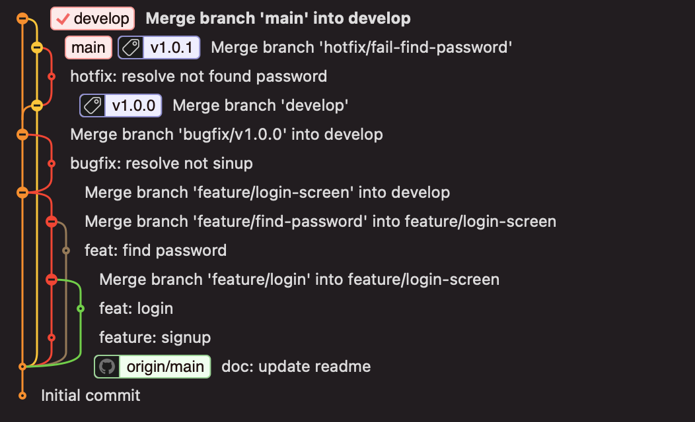

# Git 사용법 간단 설명

# Git을 왜 써야 하는가?

git은 다음과 같은 장점이 있습니다.

* 효율적인 배포관리
* 효과적인 협업

## 효과적인 협업
규모가 있는 프로젝트를 진행하다 보면 둘 이상의 사람들과 협업을 하게 됩니다. 예를 들면 A라는 앱을 개발하게 된다면 한 명은 로그인을 다른 사람을 로그아웃을 개발할 수 있을 겁니다.

하지만 만약 로그인 기능을 두 명이서 나눠 작업하게 되면 코드를 어떻게 합치게 되어야 할까요?
어느 부분이 변경되었는지 일일이 코드를 한 줄 한 줄 확인해 가며 서로 겹치는 부분은 없는지 어느 부분이 수정이 되었는지 확인을 해가며 합쳐야 할 것입니다.

또한 이때 실수를 범하게 된다면 버그로 이어지는 참사가 일어날 것입니다.😦😦😦😦😦😦😦😦😦

git을 사용하게 되면 누가 무엇을 수정했는지 기록이 남고, 또한 모든 변경 내용은 서버에 반영이 됩니다.
그런 이유에 있어 작업자는 항상 최신의 코드를 유지할 수 있으며 코드적인 측면에서 충돌이 날 경우 conflict가이 발생하여 병합 과정에서의 코드 검증 시간이 획기적으로 단축될 수 있다고 생각 합니다.

## 효율적인 배포
프로젝트의 크기 및 복잡도에 따라 배포를 하기까지 많은 과정들이 있습니다. 예를 들면 개발된 내용들을 한곳으로 모아야 하고, 또한 QA를 통해 검증을 해야 하고 이때 발생한 이슈들을 처리도 해야 합니다. 이때 git을 사용하게 되면 branch의 전략에 따라 나뉘어 코드 상태 관리를 할 수 있으며, 배포 후 문제가 생겨 코드를 되돌려야 하는 상황에도 간단하게 이전 기록을 기준으로 쉽게 코드를 되돌릴 수 있습니다.

# 사전 준비
* Homebrew 설치
* Git 설치

# Homebrew 설치
```
/bin/bash -c "$(curl -fsSL https://raw.githubusercontent.com/Homebrew/install/HEAD/install.sh)"
```

# Git 설치
```
brew install git
```

# Git 간단 명령어
* git init : git 초기화 하기
    ```
    git init
    ```
* git clone "git_path" : 서버로부터 코드 가져오기
    ```
    git clone https://github.com/kts6056/git-seminar.git
    ```
* git status : 현재 git 상태 표시
    ```
    git status
    ```
* git switch "branch_name" : 원격 / 로컬 브랜치 선택하기
    ```
    git switch main
    ```
* git switch -c "branch_name" : branch_name 기준으로 생성 후 해당 branch로 이동
    ```
    git switch -c develop
    ```
* git branch -r : 원격 브랜치 목록보기
    ```
    git branch -r
    ```
* git branch -a : 로컬 브랜치 목록보기
    ```
    git branch -a
    ```
* git branch -m "branch_name" "change_branch_name" : branch_name 브랜치 이름을 change_branch_name로 변경
    ```
    git branch -m feature/Android-10 feature/Android-100
    ```
* git branch -d "branch_name" : local에서 branch_name 브랜치 제거
    ```
    git branch -d feature/Android-100
    ```
* git push remote_name --delete "branch_name" : 서버에서 branch_name 브랜치 제거    
    ```
    git push origin --delete feature/Android-100
    ```
* git add "file_path" : 작업된 내용중 stage에 올릴 코드 선택
    ```
    git add ./src
    src 폴더 하위 팔일들만 변경점 stage로 이동
    git add .
    현재 폴더 기준으로 하위 파일들 변경점 stage로 이동
    ```
* git commit -m “commit_description” : stage에 올라간 파일 기준으로 commit 메세지 기록
    ```
    git commit -m "doc: readme update"
    ```
* git commit --amend : 현재 stage에 올라간 파일과 바로 직전 커밋을 통합하여 새로운 커밋을 기록
    ```
    git commit --amend
    ```
* git push --set-upstream "remote_path" "branch_name" : 서버에서 tracking 되지 않는 branch를 local 기준으로 업데이트
    ```
    git push --set-upstream origin feature/Android-100
    ```
* git push / git push "romote_name" "branch_name" : local에 기록된 commit들을 서버로 전송
    ```
    git push origin feature/Android-100
    ```
* git fetch : 서버의 최신 상태 정보 업데이트
    ```
    git fetch
    ```
* git pull : 현재 branch를 서버 기준으로 코드 최신으로 업데이트
    ```
    git pull
    ```
* git reset --hard HEAD^ : 이전 commit 취소하기
    ```
    git reset --hard HEAD^
    ```
* git reset --soft HEAD^ : 작업된 내용은 남기고 이전 commit 취소하기
    ```
    git reset --soft HEAD^
    ```
* git reset — hard HEAD && git pull : 작업된 내용은 제거하고 서버 기준으로 코드 최신화
    ```
    git reset — hard HEAD && git pull
    ```
* git stash / git stash save “description” : 작업된 내용을 임시저장소로 저장
    ```
    git stash or git stash save feature-signup
    ```
* git stash apply : 마지막으로 임시저장된 작업코드는 유지한채 가져오기
    ```
    git stash apply
    ```
* git stash pop : 마지막으로 임시저장한 작업코드를 제거함과 동시에 가져오기
    ```
    git stash pop
    ```
* git rebase "branch_name" : 현재 브랜치의 base 되는 코드를 branch_name HEAD 기준으로 재배치
    ```
    git rebase develop
    ```

# 효율적인 커밋 메세지 작성법

커밋 메시지 스타일을 조금만 변경해도 더 나은 프로그래머가 될 수 있습니다.

Format: `<type>(<scope>): <subject>`

`<scope>` is optional

## 예제

```
feat: add hat wobble
^--^  ^------------^
|     |
|     +-> 작업된 내용 요약
|
+-------> Type: chore, docs, feat, fix, refactor, style, or test.
```

더 많은 예제:

- `feat`: 사용자를 위한 새로운 기능 (빌드 스크립트 개발은 제외)
- `fix`: 사용자를 위한 수정 혹은 버그 픽스 (빌드 스크립트 수정은 제외)
- `docs`: 문서가 변경될 때
- `style`: formatting, convention, lint, 그 외 기타 (제품에 대한 코드 변경은 제외)
- `refactor`: 제품에 대한 리팩토링, 변수에 대한 이름 변경 등 기타 수정
- `test`: 놓친 테스트 코드 작성 및 테스트 코드 수정 (제품에 대한 코드 변경은 제외)
- `chore`: 간단한 버전 코드 업데이트 혹은 그에 상응하는 간단한 작업들

참조:
- https://www.conventionalcommits.org/
- https://seesparkbox.com/foundry/semantic_commit_messages
- http://karma-runner.github.io/1.0/dev/git-commit-msg.html


# git flow란?
깃플로우(git-flow)는 소프트웨어의 코드를 관리하고 출시하기 위한 "브랜치 관리 전략 (branch management strategy)" 중 한가지 방법입니다.
대표적인 브랜치는 다음과 같다.
* main - 실제로 배포 되는 브랜치
* develop - 다음 출시 버전에 포함될 기능을 개발하는 브랜치
* feature - 기능을 개발하는 브랜치
* release - 현재 배푀될 버전을 준비하는 브랜치
* hotfix - 이미 배포된 버전에서 발생한 버그를 수정하는 브랜치


# 개발 흐름
현재 Flitto에서 Android 개발을 하고 배포되는 흐름은 다음과 같습니다.

1. 스프린트 플래닝을 통해 이번 주기에서 작업 될 내용들을 정리합니다.
2. 정기 배포 주기에 따라 배포될 티켓과 계속 진행 될 티켓들을 정리합니다.
3. 정기배포를 위해 QA 기간을 산정해서 날짜를 정한 뒤 해당 일정까지 기능을 개발합니다.
4. QA 기간동안은 현재 개발된 내용을 바탕으로 QA 검증 과정을 거치게 됩니다.
5. QA 검증 과정중 나온 이슈를 처리하여 해결합니다.
6. 단계적 배포를 실시합니다.
7. Release 버전을 tagging 합니다.
8. 배포 후 모니터링을 거쳐 단계적 배포를 마무리 합니다.

## git 기준으로 생각하기
로그인 화면을 개편한다고 가정하고 git 기준으로 흐름을 알아보도록 합시다.

로그인 화면에서는 회원가입, 로그인, 비밀번호 찾기 기능이 필요합니다.

그렇다면 현재 develop 기준으로 feature/login-screen 이란 브랜치를 하나 만들게 되고

feature/login-screen 기준으로 feature/login, feature/signup, feature/find-password 3개의 브랜치가 만들어 질것입니다.


협업을 통해 3가지 기능이 동시에 진행이 되고 있다면 다음과 같을것입니다.


이제 개발이 완료 되었으면 중간 브랜치인 feature/login-screen에 pull-request를 진행하여 code review를 받고, merge를 하게 됩니다.


이제 개발이 완료 되었으니 develop에 합치게 되고 QA 신청을 하여 QA 검증을 거치게 됩니다.


이때 만약 회원가입에 문제가 있어 가입되지 않은 문제가 발생한 경우 develop 브랜치 기준으로 bugfix 용 branch를 생성 후 이슈를 처리 합니다.


이제 다시 develop으로 pull-request를 요청하여 qa를 마무리 합니다.


이제 검증과정을 마쳤으니 배포를 위해 main 브랜치로 pull-request를 거쳐 merge를 하고 버전 태깅을 합니다.


만약 이때 배포 나간 버전에서 버그가 생겨 hotfix를 진행하게 된다면 main 브랜치에서 hotfix branch를 따게 됩니다.


핫픽스가 준비되면 이제 main으로 pull-request 요청해서 merge 후 배포와 tagging 작업을 합니다. 그 후 hotfix를 통해 수정된 내용을 develop에도 sync 합니다.

